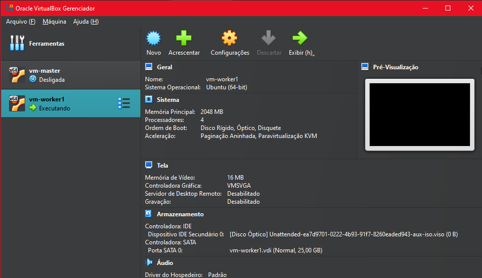
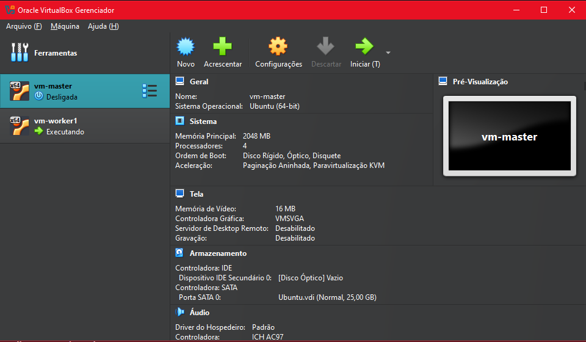
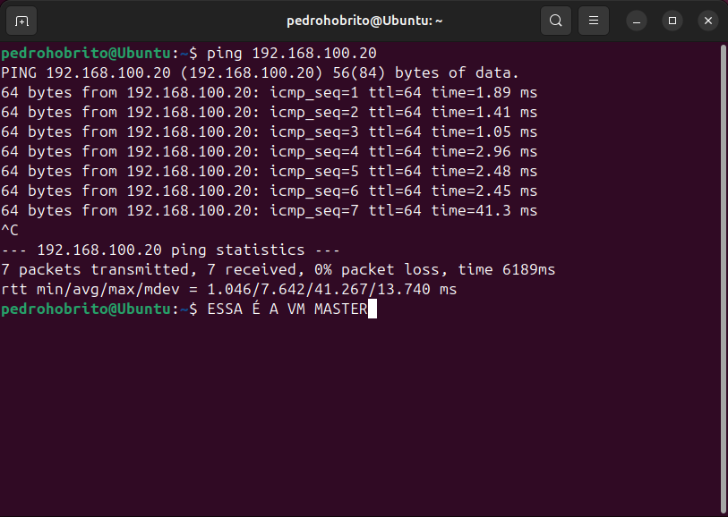
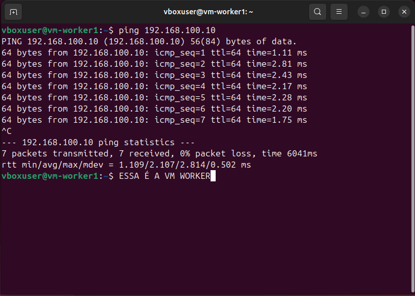
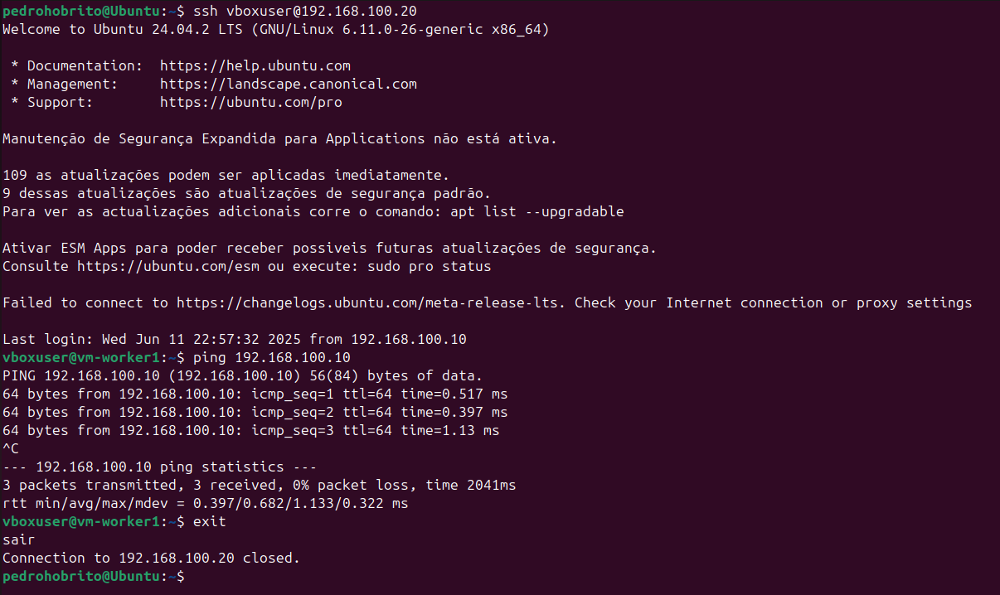
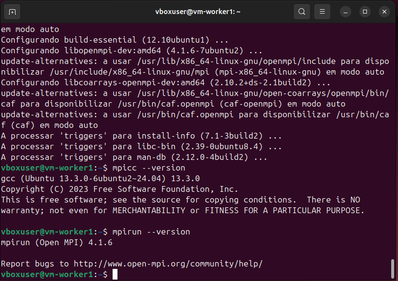

# Relatório - Comunicação MPI entre Máquinas Virtuais no VirtualBox

**Aluno:** Pedro Henrique Oliveira Brito  
**Curso:** Ciência da Computação  
**Instituição:** Centro Universitário Senac  
**Disciplina:** Computação Paralela e Distribuída  
**Data:** Junho de 2025

---

## 1. Objetivo

O objetivo deste trabalho é colocar em prática os conceitos de comunicação entre processos via MPI (Message Passing Interface), utilizando um ambiente distribuído com máquinas virtuais. As principais metas são:

- Configurar a comunicação entre VMs via rede interna.
- Habilitar conexão SSH sem senha entre as VMs.
- Implementar uma aplicação em C com MPI, que realiza troca de mensagens entre processos.
- Executar a aplicação usando `mpirun` e analisar os resultados.

---

## 2. Configuração do Ambiente

### 2.1 Máquinas Virtuais

- **Plataforma:** VirtualBox 7.x  
- **Sistema Operacional:** Ubuntu Server 20.04 LTS  
- **Recursos por VM:**
  - RAM: 2 GB
  - vCPUs: 2
  - Armazenamento: 20 GB
  - Rede: Interna (nome da rede: `mpi-net`)

| VM   | Hostname    | Endereço IP     | Papel   |
|------|-------------|------------------|---------|
| VM1  | vm-master   | 192.168.100.10   | Master  |
| VM2  | vm-worker1  | 192.168.100.20   | Worker  |




### 2.2 Rede e SSH

- Configuração de IP estático via Netplan
- Conexão via SSH sem senha:

```bash
ssh-keygen -t rsa -b 2048
ssh-copy-id usuario@192.168.100.20
```






---

## 3. Instalação do MPI

Executado nas duas VMs:

```bash
sudo apt update && sudo apt install openmpi-bin libopenmpi-dev build-essential -y
```

Verificação:

```bash
mpicc --version
mpirun --version
```




---

## 4. Implementação MPI (C)

A aplicação implementa uma troca simples de mensagens entre dois processos.

```c
#include <mpi.h>
#include <stdio.h>
#include <string.h>

int main(int argc, char** argv) {
    int rank, size;
    MPI_Init(&argc, &argv);
    MPI_Comm_rank(MPI_COMM_WORLD, &rank);
    MPI_Comm_size(MPI_COMM_WORLD, &size);

    if (size < 2) {
        if (rank == 0) printf("Este programa precisa de ao menos 2 processos.\n");
        MPI_Finalize();
        return 0;
    }

    if (rank == 0) {
        char mensagem[] = "Ola do processo Master!";
        MPI_Send(mensagem, strlen(mensagem)+1, MPI_CHAR, 1, 0, MPI_COMM_WORLD);
        printf("Processo %d enviou a mensagem.\n", rank);
    } else if (rank == 1) {
        char buffer[100];
        MPI_Recv(buffer, 100, MPI_CHAR, 0, 0, MPI_COMM_WORLD, MPI_STATUS_IGNORE);
        printf("Processo %d recebeu: %s\n", rank, buffer);
    }

    MPI_Finalize();
    return 0;
}
```

---

## 5. Execução da Aplicação

Comando usado:

```bash
mpirun -np 2 --host 192.168.100.10,192.168.100.20 ./mensagem
```

Saída esperada:

```
Processo 0 enviou a mensagem.
Processo 1 recebeu: Ola do processo Master!
```

---

## 6. Dificuldades e Soluções

| Problema                | Solução                                                 |
|-------------------------|----------------------------------------------------------|
| VMs não se comunicavam  | Ajuste manual de IPs e configuração de rede interna     |
| SSH solicitando senha   | Configuração de autenticação por chave RSA             |
| Erros no `mpirun`       | Verificação de IPs, nomes de host e recompilação        |

---

## 7. Aprendizados

- Como configurar ambientes virtuais distribuídos
- Uso prático do MPI para troca de mensagens
- Importância de uma rede bem configurada
- Depuração de aplicações paralelas em múltiplas máquinas

---